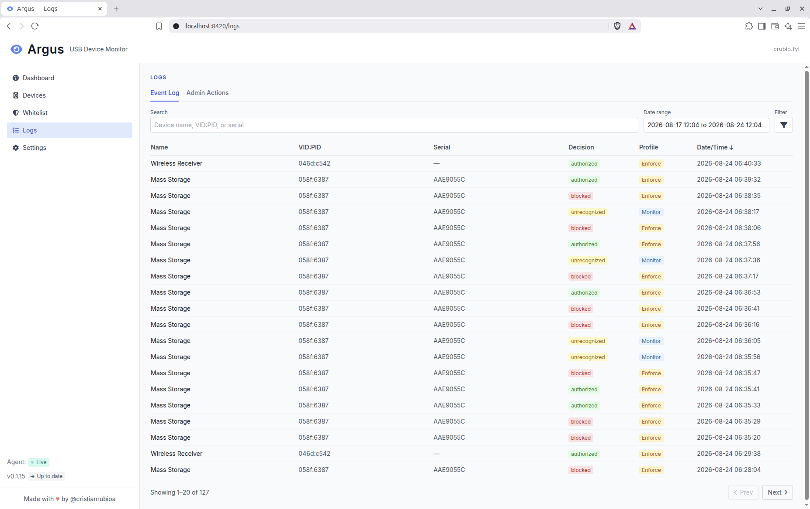
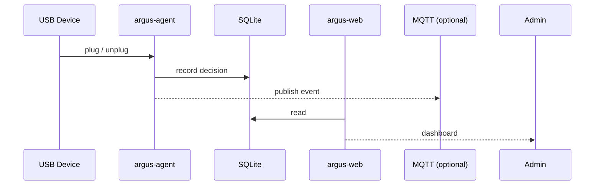

# Argus

[](https://github.com/cristianrubioa/argus/actions/workflows/ci.yml)
[](https://github.com/cristianrubioa/argus/releases)
[](https://www.python.org/downloads/)
[](LICENSE)

USB device monitoring and control, built on [USBGuard](https://usbguard.github.io/). Runs on Debian/Ubuntu.



## How it works



`argus-agent` is the only piece that talks to the `usbguard` CLI; `argus-web` only reads/writes SQLite. Both run as systemd services on the same host, sharing one database file.

## Install

```
curl -fsSL https://install.crubio.fyi/argus | sudo bash
```

Tested against USBGuard 1.1.2.

Installs USBGuard, `argus-agent`, and `argus-web`, and starts both (`systemctl status argus.target`). Visit `http://<device-ip-or-hostname>:8420` from any device on your network — first visit creates the admin account. Starts in Monitor mode by default.

On a desktop with a GNOME session, install also adds a tray icon (top bar + Applications menu) that opens the dashboard — log out and back in once if it doesn't appear.

To update, run the same command again. To uninstall:

```
curl -fsSL https://raw.githubusercontent.com/cristianrubioa/argus/main/scripts/uninstall.sh | sudo bash
```

Keeps `/var/lib/argus` and `/etc/argus` — `rm -rf` them yourself for a full wipe.

Plain HTTP, meant for LAN use — put a TLS reverse proxy in front before exposing it beyond your network.

Running from a local clone instead? See [`CONTRIBUTING.md`](CONTRIBUTING.md).

## Configuration

Full list in [`agent.env.example`](agent.env.example), copied to `/etc/argus/agent.env` on install — every value has a documented default.

One optional integration:

- **MQTT bridge** — publishes every device event to a broker. Configured from the Settings page (host, port, topic prefix, and an enable/disable toggle) — disabled by default.

Log retention (device events, applied whitelist actions, admin actions) is set from the Settings page — 90 days / 1 year / 2 years / forever, defaulting to 1 year. Pruning is irreversible.

```
make mqtt-broker   # throwaway Mosquitto on localhost:1883
make mqtt-watch    # prints every message as it arrives
```

## Development

Requires Python 3.12+ and [Poetry](https://python-poetry.org/docs/#installation) installed.

```
make deps         # poetry install
make run-web      # argus-web, live reload
make run-agent    # argus-agent (needs usbguard installed locally)
make check        # ruff check + format --check
make test         # pytest
make fix          # ruff --fix + format + rebuild static/app.css
```

`ARGUS_DB_PATH` unset → SQLite at `./data/argus.db`, separate from the `/var/lib/argus/argus.db` a real install uses.

## Contributing

See [`CONTRIBUTING.md`](CONTRIBUTING.md).

## License

MIT — see [`LICENSE`](LICENSE).
